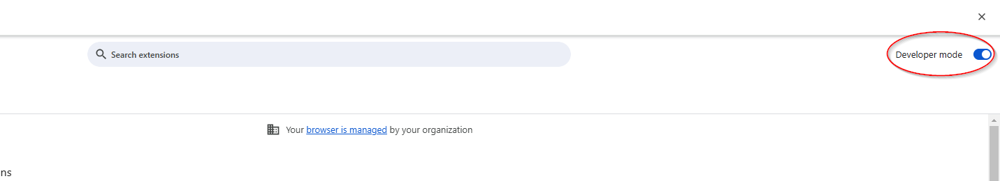
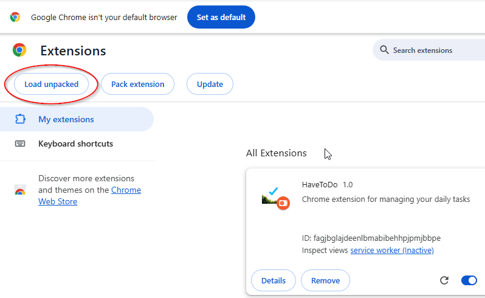

# HaveToDo - Your Daily Task Manager

Youtube Video link: https://www.youtube.com/example

HaveToDo is a Chrome extension designed to help you manage your daily tasks efficiently. It provides a simple and intuitive interface to add, edit, delete, and mark tasks as done. Additionally, it includes a timer feature to help you stay focused and manage your time effectively.

## Built With

* [](#)
* [](#)
* [](#)

## Features

- **Task Management**: Add, edit, delete, and mark tasks as done.
- **Timer**: A built-in timer to help you manage your time and stay focused.
- **Persistent Storage**: Tasks and timer state are saved in Chrome's local storage, so your data is preserved even after closing the browser.
- **Notifications**: Receive notifications when the timer finishes.

## Installation

> [!NOTE]
> This extension is not publicly shared in Chrome Web Store. If you want to download the
> extension, please follow these steps.

To install the HaveToDo Chrome extension, follow these steps:

1. Clone the repository to your local machine:
    ```bash
    git clone https://github.com/Erenimo3442/CS50-Final-Project.git
    ```

2. Open Chrome and navigate to `chrome://extensions/`.

3. Enable "Developer mode" by toggling the switch in the top right corner.



4. Click on the "Load unpacked" button and select the directory where you cloned the repository.



5. The HaveToDo extension should now be installed and visible in your Chrome extensions.

## Usage

### Task Management

1. Open the HaveToDo extension by clicking on its icon in the Chrome toolbar.
2. In the "Tasks" tab, you can add a new task by typing in the input field and pressing Enter.
3. Tasks will be displayed in the task list. You can mark a task as done by clicking the check circle icon, edit a task by clicking the edit icon, or delete a task by clicking the delete icon.
4. Completed tasks will be moved to the "Done" section.

### Timer

1. Switch to the "Timer" tab to access the timer feature.
2. The timer is set to 25 minutes by default. You can adjust the timer using buttons on the top and down. 
3. You can start the timer by clicking the play button.
4. Once the timer is running, you can pause it by clicking the pause button or stop it by clicking the stop button.
5. When the timer finishes, you will receive a notification.

## Chrome API's In Project

- [chrome.storage](https://developer.chrome.com/docs/extensions/reference/api/storage)
- [chrome.alarms](https://developer.chrome.com/docs/extensions/reference/api/alarms)
- [chrome.notifications](https://developer.chrome.com/docs/extensions/reference/api/notifications)

## File Structure

```
HaveToDo/
├── manifest.json
├── background.js
├── popup/
│   ├── popup.html
│   ├── popup.js
│   ├── timer.html
│   ├── timer.js
│   └── style.css
└── images/
    ├── icon16.png
    ├── icon32.png
    ├── icon48.png
    └── icon128.png
```

The project directory contains the following files:

- `popup/popup.html`: The HTML file for the task management interface.
- `popup/timer.html`: The HTML file for the timer interface.
- `popup/popup.js`: The JavaScript file for the task management functionality. Everything that helps the functionality of task management lies here. Created tasks will be added to both Chrome local storage and HTML. Similarly, for both edit and delete functions, Chrome local storage will get updated for future access, and HTML will get updated for immediate access. Tasks, marked as done, will stored on the bottom of the HTML. Since everything is stored in Chrome local storage, any change on tasks will not get lost. 
- `popup/timer.js`: The JavaScript file for the timer functionality. Everything that helps the functionality of task management lies here. Loaded HTML will differ according to the states of the alarm. If alarm is stopped, timer can be adjusted to any time and play button can be used to start the alarm. While alarm is playing, timer is not adjustable. Timer can be paused or stopped in playing phase. If paused, still timer is not adjustable, but can be played again. If stopped, timer is reverted into '25:00' and is adjustable again. If the timer is up, notification will pop up and alarm the user.
- `popup/style.css`: The CSS file for styling the extension.
- `background.js`: The background script for handling alarms and notifications. chrome.alarms and chrome.notifications are highly used in this file. Requests sent from 'timer.js' will be handled here. 
- `manifest.json`: The manifest file for the Chrome extension.

## Contributing

Contributions are welcome! If you have any suggestions or improvements, feel free to create a pull request or open an issue.

## Acknowledgements

- [Google Material Icons](https://fonts.google.com/icons) for the icons used in the extension.
- [Chrome Extensions Documentation](https://developer.chrome.com/docs/extensions/) for guidance on building Chrome extensions.
- [Mozilla MDN](https://developer.mozilla.org/en-US/) for learning JavaScript, CSS and HTML.
- [StackOverflow](https://stackoverflow.com) for specific conceptual questions or solutions.


## Contact

If you have any questions or feedback, please contact me at my GitHub account.

---

Thank you for using HaveToDo! I hope it helps you stay organized and productive.

[Bootstrap.com]: https://img.shields.io/badge/Bootstrap-563D7C?style=for-the-badge&logo=bootstrap&logoColor=white
[Bootstrap-url]: https://getbootstrap.com

